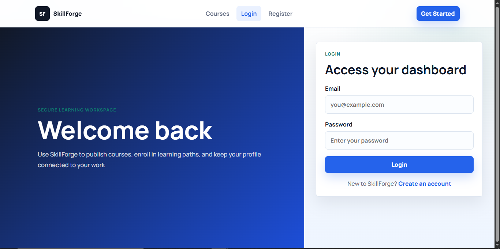
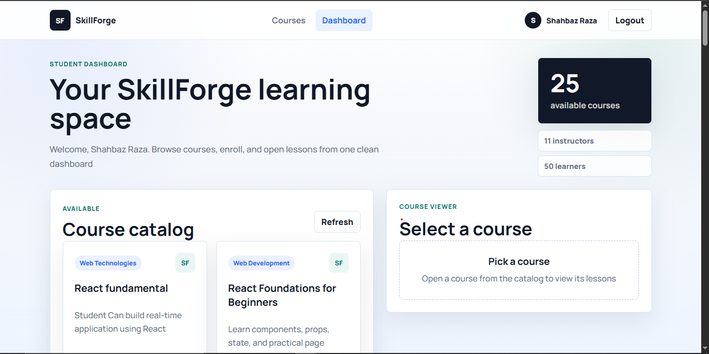

# SkillForge

SkillForge is a full-stack learning management platform that enables students to explore courses, enroll in learning programs, and track their learning progress, while instructors can create and manage courses through a dedicated dashboard.

## Features

* User Registration & Login
* JWT Authentication
* Student Dashboard
* Instructor Dashboard
* Course Creation & Management
* Course Enrollment
* Profile Management
* Responsive User Interface
* MongoDB Integration

## Tech Stack

### Frontend

* React.js
* Vite
* JavaScript
* CSS3

### Backend

* Node.js
* Express.js
* MongoDB
* Mongoose
* JWT Authentication

## Screenshots

### Home Page


### Login Page



### Student Dashboard



### Instructor Dashboard


## Installation

### Backend

```bash
cd backend
npm install
npm start
```

### Frontend

```bash
cd frontend
npm install
npm run dev
```

## Project Structure

```text
SkillForge/
├── backend/
├── frontend/
├── Snapshots/
└── README.md
```

## Author

**Shahbaz Raza**
